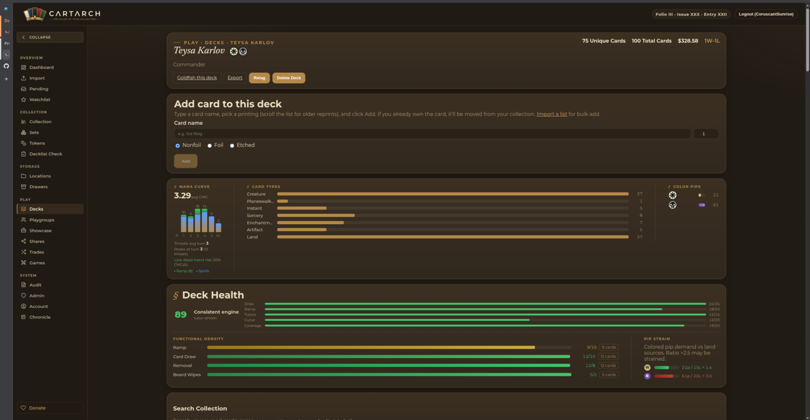
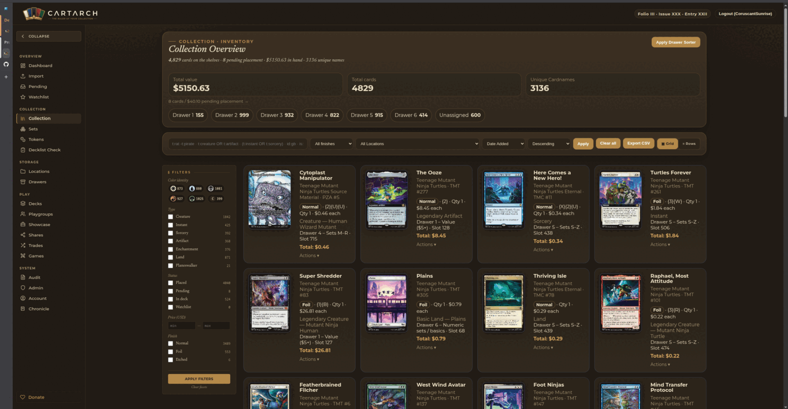
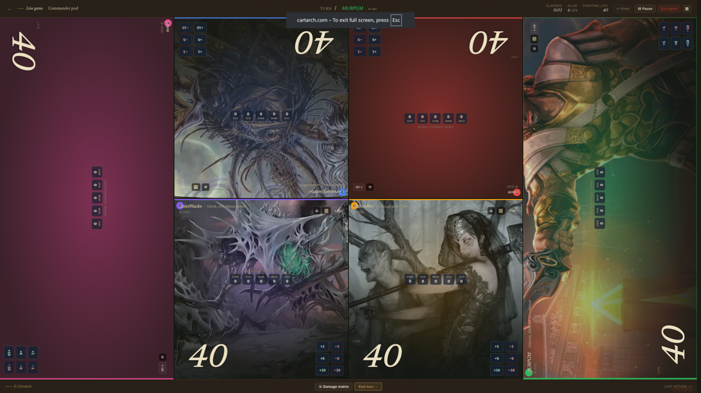

Self-hosted web application for managing a physical Magic: The Gathering collection. (Identifies as **Cartarch** in user-facing UI as of v3.27.6; the in-repo project identifier is still `mana-archive` pending the full infrastructure rename near actual public launch.)

**Current version: v3.30.14** · [Platform repo](https://github.com/jasonvandeventer/mana-archive-platform)

---

## North Star

Mana Archive is the source of truth for the playgroup. Authoritative data about who owns what, what's in which deck, and how decks have performed in our games lives here. External services (Scryfall, Commander Spellbook, EDHREC) are integrated as enrichment for that data, not as replacements.

Practical implications:

- Recommendation features ground their suggestions in the user's collection first, the playgroup's data second, and external aggregators last.
- Analytics compare a deck against the user's other decks and the playgroup's game history, not against community averages.
- External service data appears as inline enrichment (per-card hover, combo detection, inclusion percentages) rather than as primary navigation surfaces.
- Features that would route users away from Mana Archive's data toward an aggregator's data are scrutinized closely. Enrichment is welcome; replacement is not.

See [docs/ROADMAP.md](docs/ROADMAP.md) for the prioritized backlog.

---

## Screenshots



_Deck detail — hero with deck stats, Analytics (mana curve, card types, color pips), Health (functional density + pip strain), Synergy classification, dead-cards / upgrade targets, and tokens panels. (Screenshot predates v3.27.9; the bracket badge and combos panel visible in the image were removed pending the Deck Analytics Rebuild.)_



_Collection page with Scryfall-syntax search applied (`t:creature c:WU cmc:<=3`)._



_Live game tracker — tablet-oriented life/poison/commander-damage UI with per-seat rotations._

See [docs/screenshots/](docs/screenshots/) for capture guidelines and additional shots.

---

## Features

### Public surface

- **Landing page** at `/` for anonymous visitors — separate marketing surface (no app shell, no sidebar). Renders the hero ("The ruler of your collection"), four feature highlights, a 3-tile screenshot showcase, beta-interest + support + changelog cards, and a footer with Privacy / Terms / Contact links. Open Graph + Twitter meta tags make shared links render a branded card. Authenticated users at `/` get the existing dashboard unchanged — the route branches on auth state via a new `get_optional_current_user` dependency
- **Brand assets** live at `app/static/brand/` — favicon set (`.ico` + vector `.svg` + apple-touch-icon + PWA 192/512/maskable), 19 SVG logo variants, OG image. PWA-installable via `app/static/manifest.json` with `theme_color`/`background_color="#081321"`
- **`/privacy` + `/terms`** are placeholder stubs today so the landing-page footer links aren't dead; final policy text replaces them before public launch

### Dashboard

- Left-sidebar app shell with grouped nav (Overview / Collection / Storage / Play / System). Mobile (<768px): sidebar hides, the existing bottom-tab bar takes over
- **At a Glance** tile row on the populated dashboard surfaces existing data:
  - **Collection Value** — `SUM(quantity × finish-aware price)` over placed inventory; pending shown as an explicit sub-stat (placed-only headline canon — pending is never folded silently into the number)
  - **Decks Owned** — total deck count + Commander-format breakdown
  - **Recent Activity** — last 8 TransactionLog rows with card name, event type, date
- All three tiles share the same canonical unit: card-count = `SUM(InventoryRow.quantity)` everywhere (Collection / Drawers / Decks / dashboard tiles all reconcile). Drawers page reports cards, not rows, as a consequence (a drawer holding 3 rows of a 4-of reads 12 cards, not 3 rows)
- **Quick Actions** grid below the tiles for first-class flows (Pending, Import, Collection, Drawers/Locations, Decks, Games)
- Empty-state for brand-new accounts: welcome + first-step CTA + numbered next-steps replaces the wall-of-zeros that the populated dashboard would otherwise show

### Collection

- Browse and search your full inventory with Scryfall-style boolean syntax
- Keywords: `t:creature`, `c:WU`, `cmc:>3`, `o:"draw a card"`, `id:gb`, `price:>=5`, `is:foil`, `qty:>1`, and more
- Full boolean logic: `OR`, `AND`, `-negation`, `(grouping)`, quoted multi-word values
- Sort by name, type, mana cost, color, price, or **owned count** (count-sorted view groups all printings of a high-count name together — three-level grouping name → printing → location)

### Decklist Check

- Paste a decklist at `/decklist` (Moxfield / MTGA / MTGO format); see what's already in your collection, what's missing, and where each owned copy lives
- Four buckets: **Have it** (owned ≥ wanted), **Partial** (own some but fewer than wanted; shows shortfall), **Missing** (own none), **Basic lands** (set aside separately — basic-land counts aren't a meaningful trade question)
- Each Have / Partial result shows the per-printing locations, sorted **tradeable-first**: copies in `managed`/`sink` locations (loose, sortable) surface ahead of copies in `manual` locations (decks, display cases, sentimental boxes) so you see actionable inventory before "would-have-to-break-something" inventory
- Reuses the import flow's paste parser — a list that imports cleanly via `/import` matches cleanly here
- Local-only matching — pasted card names that don't match your inventory become Missing results; never falls back to a Scryfall lookup
- Stateless (no saved wantlists in v1)

### Imports

- **CSV upload** — auto-detects Scanner App, Helvault (free/pro), and Moxfield collection CSV formats
- **Paste list** — parses Moxfield deck exports, MTGA, MTGO, and standard `N CardName (SET) #` format; also accepts bare `SET COLLECTOR` lines (`MH3 145`, `MH3 145 2`, `2 MH3 145`, `*F*` for foil) so you can add cards by set + collector number alone
- Import directly to a deck or storage location at commit time
- **Inline create** — "+ Create new deck" / "+ Create new location" popouts on the import preview screen create the destination via JSON endpoints and pre-select it in the dropdown without leaving the wizard
- Import complete screen shows total cards imported + unique-row count, and a "Go to [destination]" button that links straight to the deck or location
- **Import-to-deck reconciliation** — when the destination is a deck, the preview page shows a reconciliation panel: cards already in your collection (drawer, binder, box, pending) are _moved_ into the deck instead of duplicated; new copies are imported only for cards you don't already own. Per-row override available behind a "Review individually" expand. Stale-match fallback: if inventory changes between preview and commit, the affected quantity is re-imported and surfaced as a warning on the import-result screen
- **Cards already in a deck are surfaced too** — copies in the destination deck show as "Already in this deck: N — import will merge into the existing row" (singleton-correct: a Commander deck never ends up with two rows for the same printing). Copies in OTHER decks show as informational ("In another deck: N in [deck name]") without auto-cannibalizing the source deck

### Decks

- Create and manage Commander (or any format) decks; edit name, format, and notes inline
- **Add card panel** on deck detail — type a card name, pick a printing from the Scryfall autocomplete, click Add. If you already own the card it's moved from your collection automatically; otherwise a new copy is imported. Mobile-first single-column layout
- Mark commanders; commander cards appear in a dedicated panel above the deck grid
- Full Scryfall-style search within a deck (HTMX-powered partial update: clicking Apply / pressing Enter swaps just the card grid in place, scroll position preserved, address bar updates for shareable URLs; no-JS fallback to the full-page GET form is preserved)
- **Analytics panel**: mana curve, card type breakdown, color pip counts, avg CMC
- **Health panel**: ramp/draw/removal/board-wipe density vs recommended thresholds; pip strain analysis (colored pip demand vs land color sources); consistency score
- **Synergy classification**: cards split into Direct / Supporting / Unrelated based on commander themes (death triggers, tokens, sacrifice, +1/+1 counters, tribal subtypes)
- **Dead-cards / upgrade-targets panel**: surfaces unrelated cards as replacement candidates
- **Token panel**: auto-discovers tokens produceable by the deck via Scryfall `all_parts`; click a token image to view its detail page
- **Role tag system** with 10 tags (Ramp, Draw, Tutor, Removal, Wipe, Protection, Engine, Synergy, Threat, Hate); auto-detected from oracle text and commander themes with per-tag source + confidence tracking (auto/medium vs user/high vs auto/certain); **Retag** button re-runs detection over already-tagged rows additively; **Review tags** panel on deck detail surfaces auto/medium suggestions for one-click confirm or remove
- Click any health metric count to filter the deck grid to just those cards

> _Brackets and combo display were removed from deck surfaces in v3.27.9 pending the Deck Analytics Rebuild. The underlying `bracket_v2_service` module, Commander Spellbook integration, and `compute_deck_combos` / `compute_deck_bracket` functions are preserved as dormant code for the rebuild to reuse. See `roadmap.md` Deferred / latent items "Deck Analytics Rebuild" for the path back._

### Watchlist

- Per-user list of cards to track (acquire later / compare prices on / remember)
- **Two identity modes per row** — watch a specific printing (`card_id` FK to `cards.id` — useful for collectors after a particular promo or set version) OR a card name (printing-agnostic — matches the "I want a Sol Ring" mental model). Exactly one identity mode populated per row; both can be active independently for the same card
- Add a card to the watchlist from any card detail page (`/cards/{id}`); four button states show whether you're already watching this printing and/or any printing of the same name
- `/watchlist` page shows every watched card with Card / Watch type / Owned / Added / Note columns. Owned count splits placed and pending (printing-specific watches show the printing's count; name watches aggregate across all printings)
- Optional note per row for context ("for the Bello deck", "$3 target", etc.); inline edit via a popout

### Organization

- Drawer/slot system for physical organization (gated per-user)
- Custom storage locations: create, edit (name/type/parent/sort order), and delete
- Move cards between locations from the location detail page or deck detail page
- **Bulk move**: select multiple cards from a location or deck and move them in one action; destination picker includes both storage locations and other decks; drawer-sorter users get a "Return to Sorter" option that bulk-returns rows to pending and triggers auto-placement
- Return cards from decks to pending/collection
- **CSV export**: download your full collection or any individual location as a CSV (Name, Set, Collector Number, Finish, Quantity, Location)

### Pricing & Card Data

- Live Scryfall pricing (USD regular, foil, etched) per card and deck totals
- Background price refresh loop keeps data fresh
- Card attributes: colors, color identity, mana cost, CMC, oracle text, type line

### Multi-user

- **Self-service registration** — users sign up with email + display name; no admin involvement required. `POST /register` returns a byte-identical response (same 303 + `Location: /login` + body) for both fresh-email and duplicate-email submissions; the duplicate path runs an equivalent-cost throwaway `hash_password()` so a side-channel timing oracle can't distinguish the two paths
- **Self-service password recovery** at `/forgot-password` — email-driven reset via Resend (the project's outbound transactional email path). Tokens are SHA-256 hashed at rest (raw token only ever in the emailed link), 30-minute expiry, single-use, invalidate-on-new-request. POST `/forgot-password` returns an identical neutral response for registered vs unregistered emails; the send is asynchronous via a daemon thread so there's no timing leak. Rate-limited per-email AND per-IP at 5 requests/hour
- **Update Profile form** at `/account` lets any user change their email and display name without admin DB access
- **Shared password strength validator** — 8-char minimum, 256-char maximum, no composition requirements (NIST SP 800-63B aligned); applied at `/register`, `/account/change-password`, AND `/reset-password` so the three password-set paths can't drift
- Admin panel: create/delete users, toggle admin/active, reset passwords
- Display names shown throughout the UI; email used as login identifier
- Per-user data isolation; drawer sorter is opt-in per username

### Game Tracker

- Log Commander games: format, starting life total, 2–8 players with optional user + deck linkage
- **Full in-browser life tracking**: ±1/±5/±10 life buttons, per-player color coding
- **Commander damage matrix**: track damage dealt per commander, auto-adjusts receiver's life total
- **Poison and experience counters** with danger/warning thresholds
- **Turn counter** and recent action history bar
- **Undo**: reverses last action (including both sides of commander damage)
- **Elimination toggle**: mark players as eliminated; auto-detects winner when 1 player remains
- State persisted to `localStorage` — survives page refresh mid-game
- End Game records placements, final life totals, and turn count; W/L record shown on each deck's detail page

### Tokens

- **Lightweight token catalog** at `/tokens` — track physical tokens you own (Pest x12, Treasure x30, etc.) separate from card inventory
- **Scryfall integration** on the new-token form: live name autocomplete, "Look up exact (set + collector)" button (auto-tries the `t`-prefix for token sets — `BIG #0006` resolves to the Golem in `tbig`), and "Search by name" picker that returns multiple matches as a visual image grid for disambiguation; DFC tokens show both faces side-by-side in the picker
- **Storage location reuse** — tokens go in any StorageLocation but are excluded from drawer-sorter automation
- **Double-sided token support** — real DFC tokens (Goblin // Treasure) auto-detected via Scryfall's `card_faces`; for sets where Scryfall stores each face as a separate single-sided record (TMH3 etc.), the "Double-sided" checkbox reveals a Back face fieldset with its own set + collector + "Look up back" button, supporting cross-set pairings (TBLB front, TBLC back)
- **Bulk add** at `/tokens/bulk-add` — paste a list of tokens; field count per line picks the type (2 = single, 3 = single+qty, 4 = DFC, 5 = DFC+qty). Per-row Scryfall lookups create the inventory rows
- **Deck Tokens-Needed** table on each deck detail page: declare what the deck needs (Pest x10, Food x8) and see Owned / Missing status pulled from your token inventory

### Sets

- Browse cards by set; token panel renders by default and includes substitute cards (`s{set_code}` like SZNR) appended after regular tokens
- Owned/Missing badges on every token tile sourced from your token inventory by `(set_code, collector_number)` match

### Mobile

- Full mobile responsiveness across every page except the live game tracker (which is intentionally tablet-landscape-first)
- Below 768px the top-bar nav collapses to a 5-tab bottom bar (Home / Collection / Decks / Games / More) with a "More" overlay containing Import, Pending, Locations, Tokens, Sets, Drawers/Audit/Admin (gated), Account, Logout
- "More" tab shows a red badge with the user's pending-placement count (capped at `99+`)
- 44px tap-target floor enforced on phone/tablet-portrait; tracker buttons exempt by design
- **Two-layer responsive treatment for wide tables**:
  - **Column-priority hiding** (v3.27.15) — `.col-priority-low` columns drop at ≤980px (laptop-narrow / tablet); `.col-priority-mid` columns drop at ≤768px (tablet portrait / phone). Applied uniformly across Decks, Watchlist, Admin, Games, Locations, Audit, and Tokens so the columns that remain stay readable without sideways scrolling being the primary interaction
  - **Stacked-card layout** at ≤480px (true phones) — six-column tables (decks, locations, games, card-detail inventory) flip via opt-in `class="stacking-table"` + `data-label` attributes; each row renders as a self-contained card with label/value pairs and action buttons grouped at the bottom
  - **Horizontal scroll** inside `.table-wrap` panels stays as the final-fallback floor for tables intrinsically wider than the available width even after column drops
- Popouts (Edit, inline-create) become viewport-centered modals on phones with semi-transparent backdrop, body scroll lock, auto-injected × close button, and dismiss on backdrop tap / Escape / × — see [docs/mobile_patterns.md](docs/mobile_patterns.md)
- Inventory card thumbnails compact further on true phones (130px below 480px, 170px at 480-768, 138px on desktop); drawer pills enforce a 44px tap-target floor
- Mobile fundamentals applied globally: 16px input font-size (prevents iOS auto-zoom on focus), `overflow-x: hidden` below 768px (page never horizontal-scrolls; tables still scroll internally), `box-sizing: border-box` on every element including pseudo-elements, `viewport-fit=cover` + `env(safe-area-inset-bottom)` for notched devices, `overflow-wrap: anywhere` on text containers, and a `min-height: 44px` floor on link-styled tap targets in nav, filter, hero, and pagination surfaces

---

## Stack

| Layer         | Technology                                    |
| ------------- | --------------------------------------------- |
| Web framework | FastAPI + Jinja2                              |
| Database      | SQLite (via SQLAlchemy)                       |
| Styling       | Custom CSS (no framework)                     |
| Card data     | [Scryfall API](https://scryfall.com/docs/api) |
| Runtime       | Docker / Kubernetes (K3s)                     |
| GitOps        | ArgoCD + ArgoCD Image Updater                 |

---

## Architecture

This repo contains **application code only**. Platform/infrastructure lives separately:

- **App repo** — this repo (FastAPI app, templates, migrations)
- **Platform repo** — [mana-archive-platform](https://github.com/jasonvandeventer/mana-archive-platform) (Kubernetes manifests, ArgoCD config)

CI builds and pushes a Docker image to GHCR on any `v*.*.*` tag. ArgoCD Image Updater detects the new tag (semver strategy) and syncs the cluster automatically.

---

## Local Development

```bash
docker compose -f docker-compose.dev.yml up --build
```

App available at `http://localhost:8000`.

### Git hooks

After cloning, activate the pre-commit lint check and post-commit auto-tagger:

```bash
git config core.hooksPath .githooks
```

The post-commit hook tags HEAD automatically whenever the commit message starts with `vX.Y.Z:`.

### Migrations

Migrations run automatically on startup via `run_migrations()` in `on_startup()`. To add a migration, drop an idempotent script in `scripts/` and register it in `scripts/run_migrations.py`.

---

## Data Storage

- **Local**: SQLite file in `/data`
- **Kubernetes**: Longhorn persistent volume mounted at `/data`

No database files are stored in this repository.
